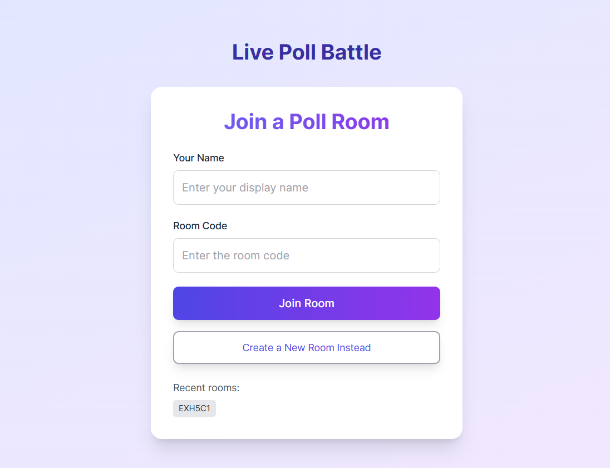
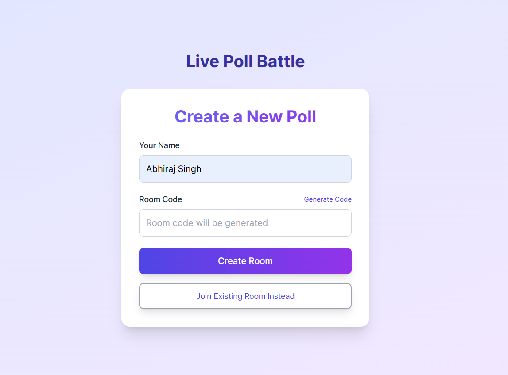
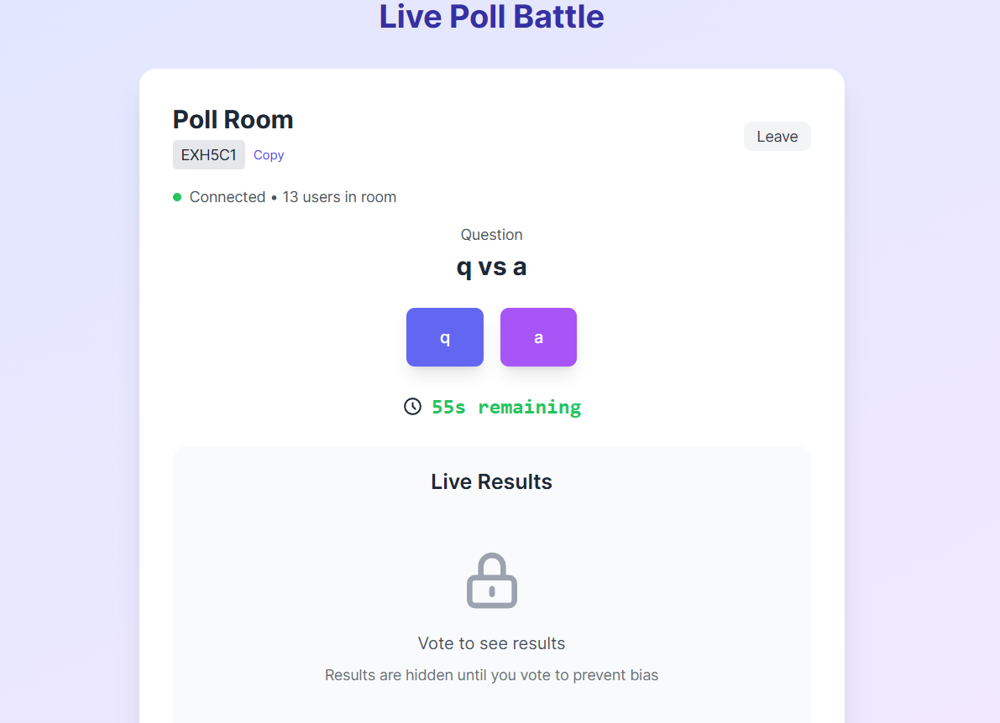
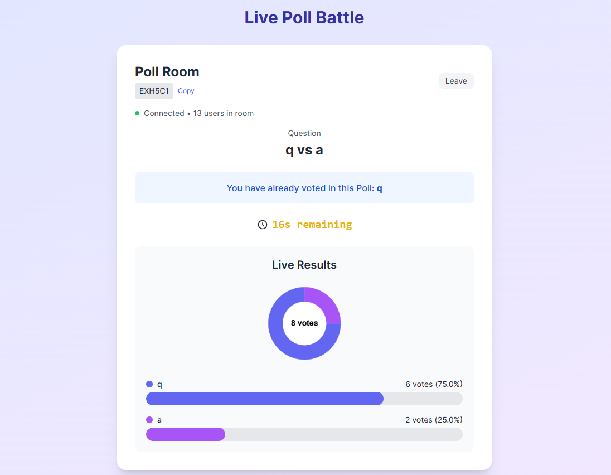

#  Live Poll Battle

Live Poll Battle is a real-time voting web app where users can create and join poll rooms, vote on custom questions, and see live results. Built using **React**, **Socket.IO**, and **Node.js**, it provides a smooth experience for creating and participating in interactive polls with live countdowns and dynamic updates.

---

##  Setup Instructions

### 1. Clone Repository
```sh
git clone https://github.com/abhiext247/live-poll-battle.git
cd live-poll-battle
```
### 📁 Folder Structure  
```
live-poll-battle/ 
├── client/ # Frontend (Vite + React + TailwindCSS) 
│ ├── public/ 
│ ├── src/ 
│ │ ├── components/ 
│ │ │ ├── JoinRoom.jsx 
│ │ │ ├── PollRoom.jsx 
│ │ │ └── VoteResult.jsx 
│ │ ├── App.jsx 
│ │ └── main.jsx 
│ ├── tailwind.config.js 
│ └── vite.config.js 
├── server/ # Backend (Node.js + Socket.IO) 
│ ├── index.js 
│ └── rooms.js 
├── README.md
```
###  2. Backend/server

1. Navigate to the server directory:
   ```bash
   cd server

2. Install Dependencies  
    ```sh
    npm install

    ```
3. Configure Environment Variables  
Create a `.env` file inside **server/** and add:  
    ```env
    PORT="your port"
    NODE_ENV
    ALLOWED_ORIGINS = "client URL"
    ```

4. Run the Application  
    ```sh
    # Start backend server
    npm start

###  3. Frontend/client

1. Navigate to the client directory:
   ```bash
   cd ..
   cd client

2. Install Dependencies  
    ```sh
    npm install

    ```
3. Configure Environment Variables  
Create a `.env` file inside **server/** and add:  
    ```env
    VITE_SERVER_URL = "backend URL"
    ```

4. Run the Application  
    ```sh
    # Start frontend
    npm run dev

## ✨ Features Implemented
- Create and join poll rooms with a unique room code.

- Admins can set custom questions and two answer options (A & B) while creating a room.

- Real-time voting updates using Socket.IO.

- One vote per user per session (vote resets if user leaves and rejoins).

- Live countdown timer (60 seconds) for voting.

- Users can only see live results after voting.

- Only room creator (admin) can delete the room.

- Deleted rooms are removed from join suggestions.

## Vote State & Room Management

Vote and room data are stored in memory using JavaScript’s Map and Set structures:

- Each room is tracked in a Map with details such as the question, options, votes, timer, admin socket ID, and a list of voted users.

- When a user votes, their socket.id is stored in a votedUsers Map to prevent multiple votes from the same session.

- If a user leaves and re-joins, they get a new socket.id and are allowed to vote again.

- Only the room creator (identified by their socket ID at room creation) can delete a room. If the admin disconnects and rejoins later, they no longer have delete privileges.

- Deleted rooms are marked and filtered out from the list of available rooms.

This structure keeps things efficient and lightweight during development. For production, a persistent database should be used.

## 🛠 Tech Stack
- Frontend: React, Vite, TailwindCSS

- Backend: Node.js, Express, Socket.IO

- Real-time: WebSockets (Socket.IO)

## Future Improvements
- Prevent users from voting again after rejoining the room.

- Support more than two poll options.

- Add authentication and user persistence.

- Store room and vote data in a database (e.g., MongoDB).

- Add results analytics and visualization.





